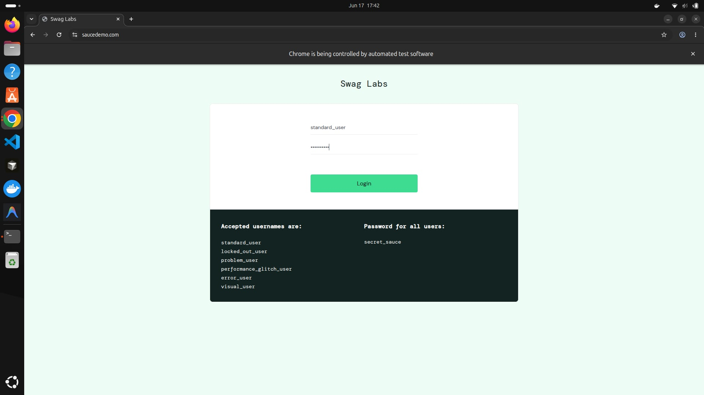
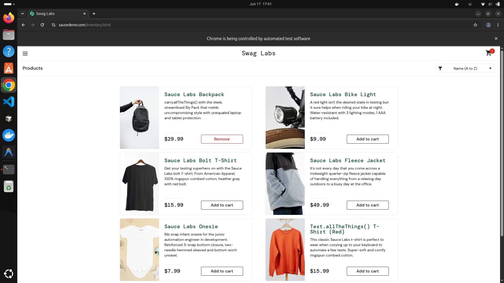
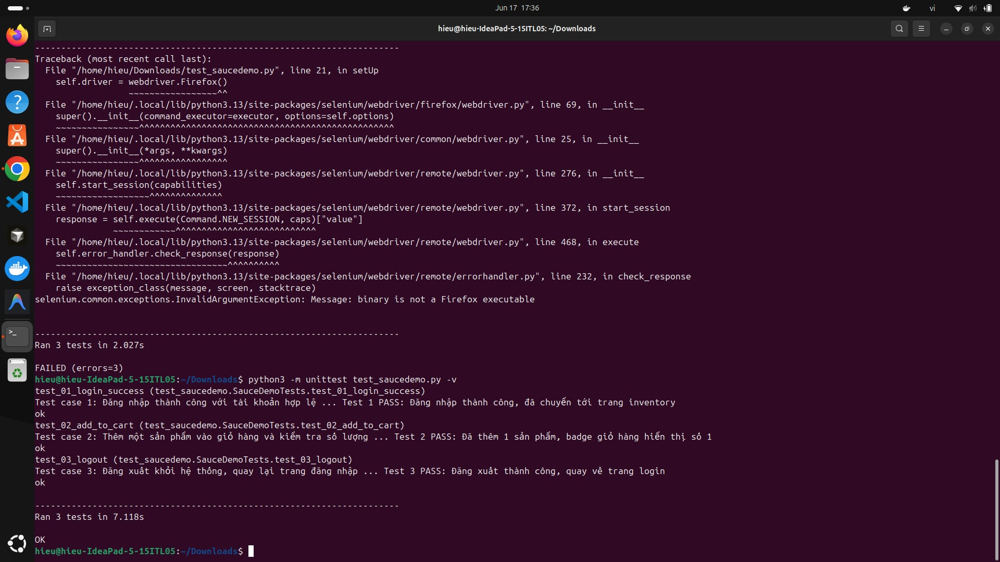

# Báo cáo học Selenium - Kiểm thử tự động giao diện web

## 1. Giới thiệu

Selenium là một công cụ mã nguồn mở dùng để điều khiển trình duyệt thật một cách tự động, giả lập đúng hành vi người dùng thật: mở trang web, gõ chữ vào ô input, bấm nút, kiểm tra nội dung hiển thị. Khác với Postman (kiểm tra trực tiếp request/response ở tầng API) và JMeter (đo hiệu năng dưới tải), Selenium kiểm thử ở tầng giao diện (UI) — phù hợp để xác nhận một luồng nghiệp vụ nhiều bước (ví dụ đăng nhập → thêm giỏ hàng → đăng xuất) có hoạt động đúng trên trình duyệt thật hay không.

Mục tiêu bài báo cáo: viết và chạy 3 test case tự động bằng Selenium (Python) trên website demo SauceDemo, gồm đăng nhập, thêm sản phẩm vào giỏ hàng, và đăng xuất.

## 2. Công cụ và website kiểm thử

- Ngôn ngữ/Framework: Python + Selenium WebDriver + unittest
- Trình duyệt: Firefox (Selenium 4 tự quản lý driver, không cần cài thủ công)
- Website kiểm thử: https://www.saucedemo.com/ (trang demo dành riêng cho luyện tập automation testing)
- Tài khoản dùng để test: `standard_user` / `secret_sauce`

---

## 3. Mô tả 3 Test Case

### 3.1 Test case 1 - Đăng nhập (Login)

**Mục đích:** Kiểm tra đăng nhập thành công với tài khoản hợp lệ sẽ chuyển sang trang inventory.

**Các bước thực hiện:**
1. Mở trang `https://www.saucedemo.com/`
2. Nhập username `standard_user` vào ô có id `user-name`
3. Nhập password `secret_sauce` vào ô có id `password`
4. Bấm nút Login (id `login-button`)
5. Kiểm tra URL hiện tại có chứa `inventory.html`

**Kết quả mong đợi:** Chuyển hướng thành công tới trang inventory, không có lỗi hiển thị.

**Kết quả thực tế:** <!-- THAY VÀO: PASS hoặc FAIL, ghi rõ -->

### Hình minh hoạ
<!-- THAY ẢNH THẬT -->


---

### 3.2 Test case 2 - Thêm sản phẩm vào giỏ hàng (Add to cart)

**Mục đích:** Kiểm tra sau khi đăng nhập, bấm "Add to cart" ở một sản phẩm thì icon giỏ hàng phải hiển thị đúng số lượng.

**Các bước thực hiện:**
1. Đăng nhập (lặp lại các bước ở Test case 1)
2. Bấm nút "Add to cart" của sản phẩm Sauce Labs Backpack (id `add-to-cart-sauce-labs-backpack`)
3. Kiểm tra số hiển thị trên badge giỏ hàng (class `shopping_cart_badge`)

**Kết quả mong đợi:** Badge giỏ hàng hiển thị số `1`.

**Kết quả thực tế:** <!-- THAY VÀO: PASS hoặc FAIL -->

### Hình minh hoạ
<!-- THAY ẢNH THẬT -->


---

### 3.3 Test case 3 - Đăng xuất (Logout)

**Mục đích:** Kiểm tra sau khi đăng nhập, thực hiện đăng xuất sẽ quay trở lại đúng trang đăng nhập ban đầu.

**Các bước thực hiện:**
1. Đăng nhập (lặp lại các bước ở Test case 1)
2. Bấm vào icon menu hamburger (id `react-burger-menu-btn`)
3. Bấm vào link "Logout" (id `logout_sidebar_link`)
4. Kiểm tra URL hiện tại quay về đúng URL gốc `https://www.saucedemo.com/`

**Kết quả mong đợi:** Quay về trang login, không còn ở trang inventory.

**Kết quả thực tế:** <!-- THAY VÀO: PASS hoặc FAIL -->

### Hình minh hoạ
<!-- THAY ẢNH THẬT -->


---

## 4. Kết quả chạy toàn bộ test

Chạy lệnh:

```bash
python3 -m unittest test_saucedemo.py -v
```

Kết quả tổng hợp:

<!-- THAY VÀO: dán nguyên kết quả terminal, ví dụ:
test_01_login_success ... ok
test_02_add_to_cart ... ok
test_03_logout ... ok

Ran 3 tests in 12.450s

OK
-->

### Hình minh hoạ
<!-- THAY ẢNH THẬT: chụp toàn bộ cửa sổ Terminal sau khi unittest chạy xong -->


---

## 5. Mã nguồn

File code đầy đủ 3 test case: [`test_saucedemo.py`](./test_saucedemo.py)

Cách chạy: cài Python + `pip install selenium`, đảm bảo có Firefox trên máy, chạy lệnh ở mục 4.

## 6. Kết luận

Qua bài thực hành, đã học và áp dụng được:

- Cài đặt và sử dụng Selenium WebDriver với Python
- Định vị phần tử trên trang web bằng `By.ID` và `By.CLASS_NAME`
- Viết test case tự động hoá theo cấu trúc unittest (`setUp`, `tearDown`, các hàm `test_...`)
- Dùng `WebDriverWait` kết hợp `expected_conditions` để chờ trang load xong thay vì chờ cứng (sleep) — tránh test bị flaky
- Kiểm thử một luồng nghiệp vụ nhiều bước trên giao diện thật, khác với việc test trực tiếp ở tầng API như Postman

<!-- THAY VÀO: 1-2 câu nhận xét riêng của bạn về quá trình làm, khó khăn gặp phải -->
